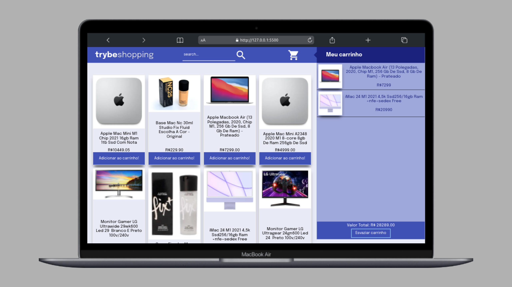

# Shopping Cart

Carrinho de compras com manipulação do DOM em JavaScript Vanilla. O consumo de dados foi realizado através da API do mercado livre
## Stacks

**Front-end:** HTML, CSS e JavaScript.

## Screenshots

## Demonstração

-[Preview](https://shopping-cartw.netlify.app/)

## Author

- [@wendryosales](https://www.linkedin.com/in/wendryosales/)

